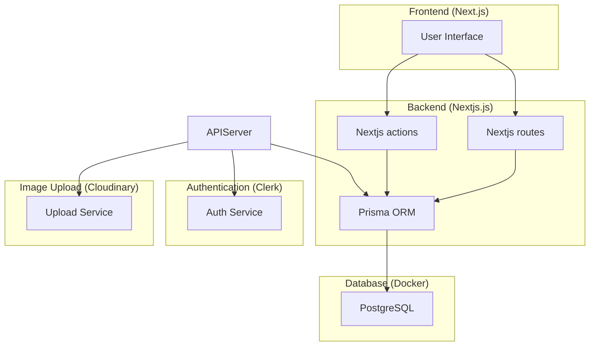

# SPEC-1: Lexagos

## Background

This project aims to build learning platform, with user management, courses, image upload, course tracking and more.
The application will be built using Next.js for the frontend, Prisma for database ORM, Docker for containerization,
and Clerk for authentication. Additional services like Cloudinary for image uploads will be integrated.

## Requirements

The following requirements are categorized based on MoSCoW prioritization:

### Must Have

- Course create, update, delete feature
- User authentication and db save through hooks using Clerk
- User profiles
- Course admin page
- Feature to track courses
- Roles with permissions (User, Admin)

### Should Have

- Tests with vitest and github actions
- Image upload via Cloudinary

### Could Have

- Custom courses
- Preloaded client components with useMemo and more optimalization tools

### Won't Have

- Extensive third-party integrations

## Method

### High-Level Architecture Design

The architecture for the Discord clone will include the following main components:

1. **Frontend**: Built with Next.js, it will handle the user interface and client-side logic.
2. **Backend**: Implemented with Next.js, it will use Prisma for database operations.
3. **Authentication**: Managed by Clerk with webhooks for user authentication and authorization.
4. **Database**: A relational database managed using Prisma ORM and containerized with Docker.
5. **Image Upload Service**: Integration with Cloudinary for handling image uploads.

Here's the high-level component diagram:

